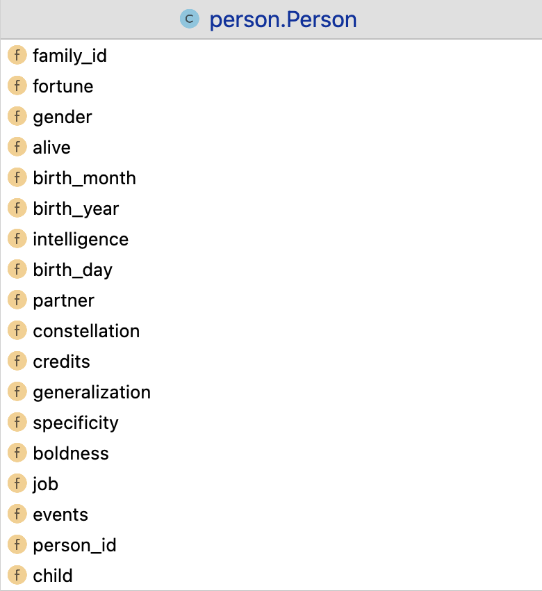

# Gods_Dice
This project endeavors to simulate human society within a virtual world, serving as a reference to elucidate real-world questions. From trivial errands to philosophical theories, there are myriad complexities inherent in human existence leading to all the possibilities. Many questions are drawn without solutions such as whether luck or diligence contribute more to individual success. Is there destiny determining predetermined outcomes? 

Or, could the real world principle be uncovered in digital community either? For instance, the famous principle ---- 20/80 principle is telling that the 80% outcomes are contributed by only the 20% factors. In economic models, this principle has explained why the majority (80%) of wealth is owned by the minority (20%) of people. I am expecting my model to find some interesting patterns like that.
'

Why did I name this model "God's Dice"? Albert Einstein once said "God does not play dice", expressing his contempt for the notion that the universe is governed by randomness and probability. For the unbalanced rules/phenomenons, he ascribed them to the hidden variable. With that said, ideally, the more comprehensive and thorough the information we incorporate, the greater the precision and accuracy the outcomes would be. Therefore, the project emphasizes the collection and integration of information, as "complete" as possible, to ensure the highest possible degree of precision and accuracy for the model and its findings.

---
The main implementations about this project is: God, Dice, and Person.

> God: Govern the community evolution and control the time machine.

> Dice: Take care of algorithms and calculations.

> Person: Each instance is a digital life.

---

# God

The functionality of the "God" module is about connecting and helping the community growth. Here are some roles (or functions) deployed in this module:

## event_messenger: 

assign events to digit lives (daily)

    
Function Details

    
1. Randomly select 30% population to assign events (30% chance to take actions) 

    
2. For each candidate: 

    
2.a rolling dice for an event 

    
2.b handle death: life-saver() OR mourner() 

    
2.c handle education: send candidate to class_container[] 

    
2.d get age at the day 

    
2.e insert_lifebook 

    
2.f apply_time_rules 

#### midwife:
proliferate the community

    
Function Details

    
 1. return a Person instance 

#### mourner:

handle death

    
Function Details

    
1. For each died person in person_container[]: 

    
2.a rolling dice for an event 

    
2.b life-saver (if event is death) 

    
2.c get age at the day 

    
2.d insert_lifebook 

    
2.e apply_time_rules 

#### death_reporter:

output death and send instance to "acient_container" (buffer)

    
Function Details

    
1. # add the past to acient_container[]: 

    
2. if buffer is full: release and output

#### match_maker:
send individuals to date and then (based on feedback) create family

#### lecturer:
gain knowledge (by raising the intelligence value)

#### philanthropist:
donate money to earn reputation and foutune

#### employer:
promote/demote a worker

#### payer:
pay the person (who has a job)

#### record_breaker:
report 1. the richest person 2. the person with the longest longevity

#### history_writer: 
I/O handler

---

The variables which have been designated to the "person" class. (Will add more in the future.)

---

Curretly, I am completing the zodiac profiles for digit lives.

12 Zodiac Signs: Aries, Taurus, Gemini, Cancer, Leo, Virgo, Libra, Scorpio, Sagittarius, Capricorn, Aquarius and Pisces

---

Some factors that I included for zodiac signs:

Emotionally intelligent:

Being emotionally intelligent means you have the ability to recognize, comprehend, and manage your own emotions. You can also recognise and influence the emotions of others. [1]

High maintenance:

Being high maintenance is about how much attention one seeks in life to exist or enjoy it to the fullest. For some people, being high maintenance is less of a choice and more of a personality trait. [2]

Confidence:

When someone is confident, they come across as self-assured in multiple situations. People would seem to know what they want and how to get it, at least on the surface. [3]

Evil:

Unveiling the dark side of the stars (The nefarious traits and enigmatic behaviors. )[4]

Artist_celebrities:

The ranking by the numbers of artist celebrities.[5]

Author_celebrities:

The ranking by the numbers of author celebrities. [5]

Dangerous:

While thieves and killers run the gamut and round out the zodiac wheel, there are certain qualities that lend themselves to deviant behavior.[6]

---
References:

[1] https://timesofindia.indiatimes.com/life-style/relationships/love-sex/the-most-emotionally-intelligent-zodiac-signs-ranked-from-most-to-least/photostory/80497899.cms

[2] https://astrotalk.com/astrology-blog/high-maintenance-zodiac-signs-ranked-as-per-astrology/

[3] When someone is confident, they come across as self-assured in multiple situations. People would seem to know what they want and how to get it, at least on the surface. 

[4] https://astrotalk.com/astrology-blog/7-most-evil-zodiac-signs-of-2023-insideastro/

[5] https://edubirdie.com/blog/the-most-successful-zodiac-signs

[6] https://nypost.com/2021/12/23/most-dangerous-zodiac-signs/
